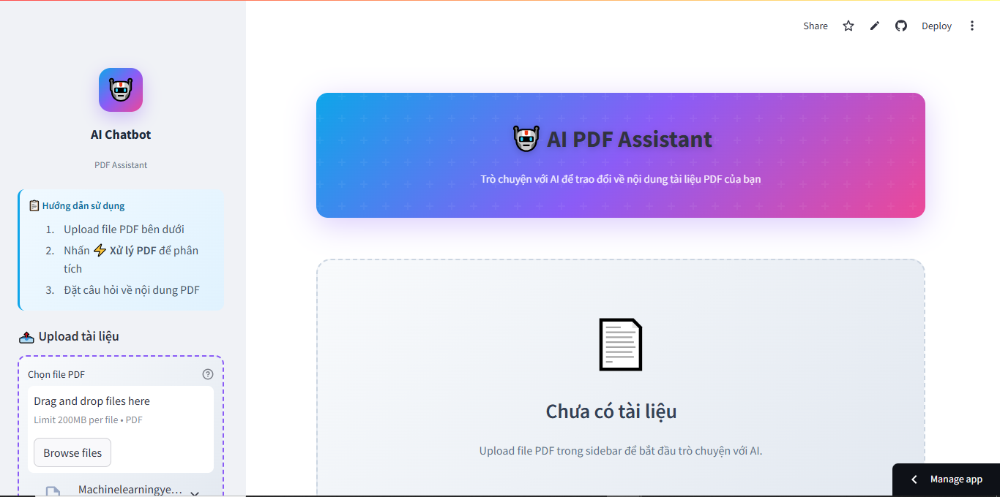

# RAG PDF Chatbot

https://ragchatbot-anhtunguyen0610.streamlit.app/

---

A Vietnamese-optimized document Q&A system built on Retrieval-Augmented Generation (RAG). Upload PDF files, ask questions in Vietnamese, and receive accurate answers grounded in your documents.


---

## Overview

This project implements a full RAG pipeline optimized for Vietnamese, with particular attention to the quality bottlenecks at each stage: chunking granularity, embedding representation, retrieval diversity, and cross-encoder reranking before generation. The system supports two operating modes depending on available hardware:

| Mode | LLM | Requirement |
|------|-----|-------------|
| **GPU** | Qwen2.5-3B-Instruct (local, 4-bit quantized) | NVIDIA GPU, VRAM ≥ 6GB |
| **CPU** | Google Gemini API (cloud) | Internet + API key |

Both modes share the same **BKAI Vietnamese Bi-Encoder** for embeddings, ensuring consistent retrieval quality regardless of the LLM backend.



---

## Project Structure

```
RAG_PDF_Chatbot/
├── app.py                  # Streamlit application entry point
├── requirements.txt
├── README.md
│
├── img/
│   └── ui.PNG
├── notebooks/
│   └── RAG.ipynb
│
└── src/
    ├── config.py           # Centralized configuration
    ├── models.py           # LLM and embedding model management
    ├── pdf_processor.py    # PDF loading, chunking, vector store creation
    ├── chat_handler.py     # RAG pipeline and answer generation
    ├── reranker.py         # Cross-encoder reranking
    ├── state_manager.py    # Streamlit session state
    ├── ui_components.py    # UI components and styling
    └── utils.py            # Text processing utilities
```

---

## Installation

**1. Clone the repository**
```bash
git clone https://github.com/AnhTuNguyen0610/RAG_Chatbot.git
cd RAG_Chatbot
```

**2. Create environment**
```bash
conda create -n ragpdf python=3.11
conda activate ragpdf
```

**3. Install dependencies**
```bash
pip install -r requirements.txt
```

**4. Run**
```bash
streamlit run app.py
```

---

## Configuration

All parameters are managed in `src/config.py`:

```python
GEMINI_MODEL_NAME         = "gemini-2.0-flash"
LOCAL_MODEL_NAME          = "Qwen/Qwen2.5-3B-Instruct"
EMBEDDING_MODEL           = "bkai-foundation-models/vietnamese-bi-encoder"

DEFAULT_DEVICE            = "cuda"        # "cpu" for Gemini API mode
DEFAULT_MAX_NEW_TOKENS    = 384
DEFAULT_TEMPERATURE       = 0.3
DEFAULT_NUM_CHUNKS        = 5
DEFAULT_MAX_CONTEXT_CHARS = 10000
```

---

## Tech Stack

| Component | Technology |
|-----------|-----------|
| Web UI | Streamlit |
| RAG Framework | LangChain |
| Vector Database | ChromaDB |
| Embedding | [BKAI Vietnamese Bi-Encoder](https://huggingface.co/bkai-foundation-models/vietnamese-bi-encoder) |
| LLM (GPU) | [Qwen2.5-3B-Instruct](https://huggingface.co/Qwen/Qwen2.5-3B-Instruct) · BitsAndBytes 4-bit NF4 |
| LLM (CPU) | Google Gemini API |
| Reranker | [PhoRanker](https://huggingface.co/itdainb/PhoRanker) · [mMiniLM multilingual](https://huggingface.co/cross-encoder/mmarco-mMiniLMv2-L12-H384-v1) |

---

